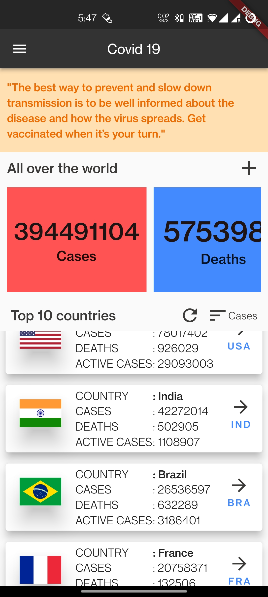
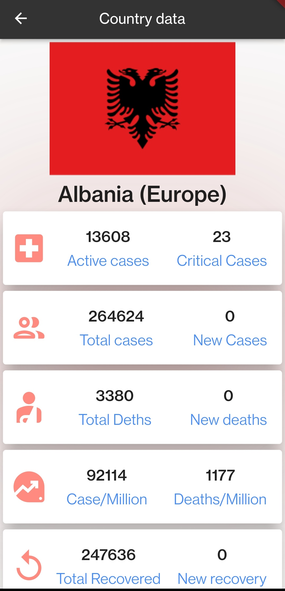

# covid19

An app for tracking Covid19 details

## Features and docs

This project is an implemetation of the following APIs:

- [disease.sh - Open Disease Data API](https://disease.sh/) 

## Dependencies used 

| Dependency name  | Version used |
| ------------- | ------------- |
| dropdown_search | ^2.0.1  |
| charts_flutter  | ^0.12.0 |

## App screens

